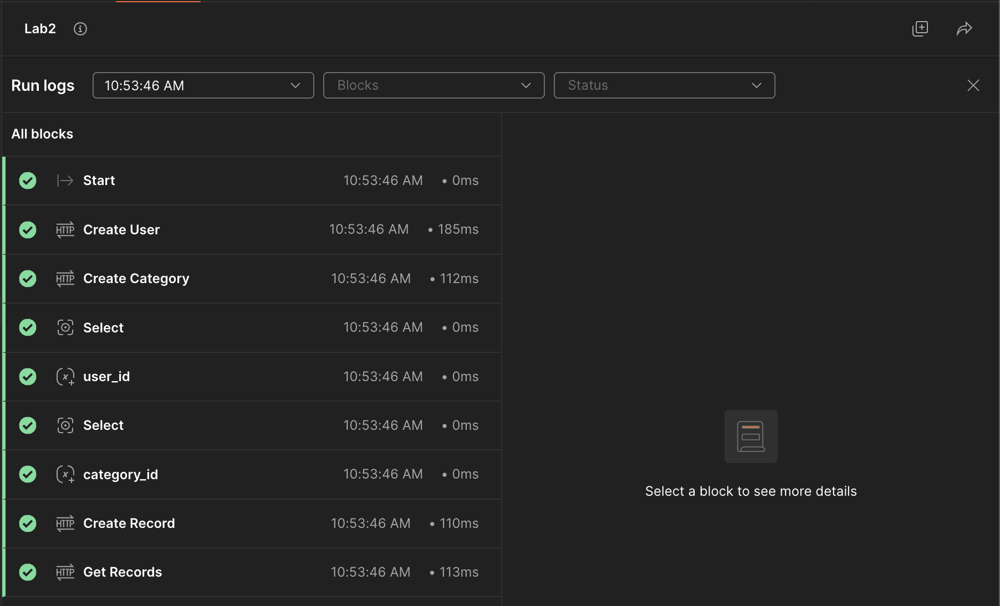
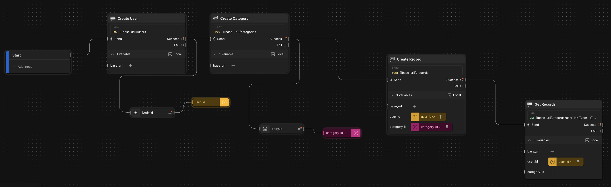

# Лабораторна робота №2

## Мета роботи
Спроєктувати простий REST API для обліку витрат із сутностями User, Category, Record, реалізувати CRUD-операції (без БД — in-memory), підготувати колекцію Postman та сценарій перевірки.

## Основні посилання
- Репозиторій проекту: [`sparrow-api`](https://github.com/pliffdax/sparrow-api)
- Деплой проекту: [`Render`](https://sparrow-api-l8pp.onrender.com/health)
- Postman:
  - Колекція: [`Lab2.postman_collection.json`](./Lab2.postman_collection.json)
  - Оточення: [`Local.postman_environment.json`](./Local.postman_environment.json), [`Prod.postman_environment.json`](./Prod.postman_environment.json)

## Стек технологій
- Go (net/http, chi)
- In-memory storage
- Docker/Compose
- Render 
- Postman Flows

# Хід виконання
1. **Ініціалізація проєкту.**
   
   Створено каркас Go-застосунку, підключено chi, додано пакет [`internal/util`](../../internal/util/) з хелперами `Getenv`, `WriteJSON`, `DecodeJSON`.
2. **Точка входу та graceful shutdown.**
   
   Винесено запуск сервера до [`internal/app/app.go`]() з таймаутами (ReadHeader/Read/Write/Idle) та коректним завершенням по SIGINT/SIGTERM. [`main.go`](../../cmd/server/main.go) лишився мінімальним.
3. **Службовий ендпоінт.**
   
   Реалізовано GET /health, що повертає status, UTC-час та `APP_VERSION`; бінд на `$PORT` для сумісності з Render.
4. **Домени.**
   
   Описано сутності User, Category, Record (UTC created_at).
5. **In-memory сховище.**
   
   Реалізовано потокобезпечні стораджі (`sync.RWMutex`, автоінкремент `seq`) для користувачів, категорій та записів витрат. Використання іменників у множині відповідає загальним REST-гайдам:
   - Колекції — `/users`, окремі ресурси — `/users/{id}`; дії виражає HTTP-дієслово (`GET/POST/DELETE`).
   - URL стають передбачуваними і краще кешуються; інтерфейс консистентний між сутностями.

   **Реалізовані шляхи:**
  
   - *Users*
     - `POST /users` — створити користувача `{ "name": "Alice" }` → `201`
     - `GET /users` — список → `200`
     - `GET /users/{id}` — отримати → `200` / `404`
     - `DELETE /users/{id}` — видалити → `204` / `404`

   - *Categories*
     - `POST /categories` — створити `{ "title": "Food" }` → `201`
     - `GET /categories` — список → `200`
     - `DELETE /categories/{id}` — видалити → `204` / `404`

   - *Records*
     - `POST /records` — створити `{ "user_id": 1, "category_id": 1, "amount": 99.5, "created_at"?: RFC3339 }`  
       Перевіряються наявні `user_id` та `category_id`. → `201` / `400`
     - `GET /records?user_id=&category_id=` — фільтр за одним або двома параметрами (хоча б один обовʼязковий). → `200` / `400`
     - `GET /records/{id}` — отримати → `200` / `404`
     - `DELETE /records/{id}` — видалити → `204` / `404`

6. **Postman.**
   
   Створено 2 оточення: Local (`base_url=http://localhost:8080`) та Prod (`Render URL`). Зібрано колекцію з тестами, що зберігають `user_id`, та `category_id` у змінні оточення

   
   *Скрін 6.1 — Журнал виконання Flow. Усі кроки успішні.*

   
   *Скрін 6.2 — Витяг `body.id` → збереження `user_id`/`category_id` → створення `record` → вибірка `GET /records`.*

## Висновки

У ході виконання лабораторної роботи реалізовано базовий REST API для обліку витрат із сутностями User, Category та Record на потокобезпечних in-memory сховищах. Налаштовано graceful shutdown і таймаути серверу, маршрути у plural-стилі (/users, /categories, /records) та валідацію зв’язків під час створення запису. Підготовлено Postman-колекцію з двома оточеннями (Local/Prod) і Flow для автоматичноi перевірки всього сценарію. Рішення готове до подальшого розвитку: підключення БД, розширення валідації та уніфікації помилок.